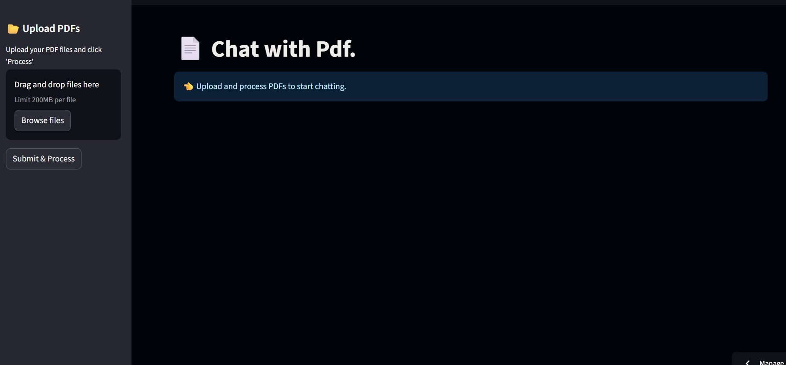
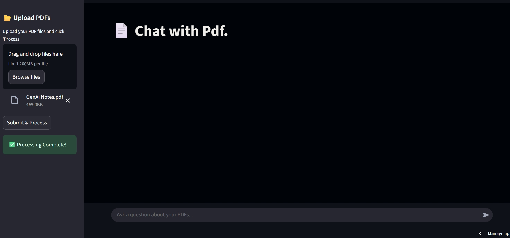
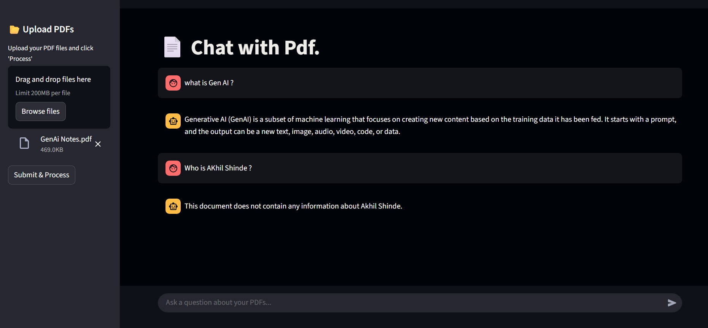
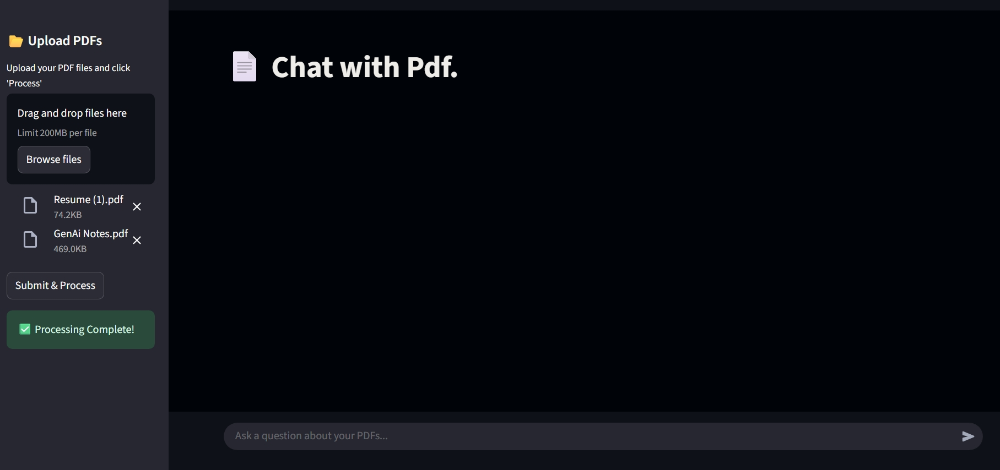
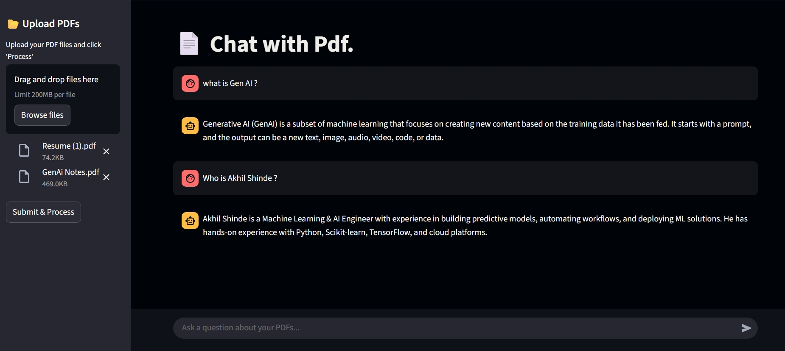

# 📚 Information Retrieval System  

> **AI-powered document question-answering system using RAG (Retrieval-Augmented Generation) and Gemini**  

  

---

## 📌 **Introduction**  

In today’s world, vast amounts of knowledge are locked inside **PDFs, research papers, and documents**. Manually searching through them is time-consuming and inefficient.  

This project provides an **AI-driven Information Retrieval System** that allows users to **upload PDFs and ask natural language questions**, getting **context-aware answers** instantly.  

It leverages **LangChain, FAISS vector database, and Google’s Gemini model** to build an interactive Q&A assistant.  

---

## 🚀 **Key Features**  

- 📄 **PDF Upload & Parsing** – Extracts text from multiple PDF documents.  
- ✂ **Text Chunking** – Splits large documents into manageable pieces for better retrieval.  
- 🔎 **Vector Search with FAISS** – Stores embeddings for fast semantic search.  
- 🤖 **Conversational Q&A** – Ask questions and get precise, context-based answers.  
- 💬 **Chat History Memory** – Keeps track of previous conversations.  
- 🌐 **Streamlit Web App** – Simple and user-friendly interface.  

---

## 🗂 **System Workflow**  

1. **Upload PDF(s)** – User uploads one or more PDF documents.  
2. **Text Extraction** – System extracts and cleans text.  
3. **Chunking** – Text is split into 1000-character chunks with overlap.  
4. **Embedding Generation** – Each chunk is converted into a vector using Google Generative AI embeddings.  
5. **Vector Store (FAISS)** – Embeddings are stored in FAISS for similarity search.  
6. **Conversational Retrieval** – User queries are matched with relevant chunks, and answers are generated using Gemini.  

---

## 🛠 **Tech Stack**  

- **Language:** Python  
- **Libraries:** LangChain, FAISS, PyPDF2, dotenv  
- **LLM & Embeddings:** Google Generative AI (Gemini, Embedding-001)  
- **Framework:** Streamlit (for web interface)  
- **Environment Management:** `.env` for local, **Streamlit Secrets Manager** for cloud  

---

## ⚡ **Setup & Installation**  

1. **Clone this repository**  
   ```bash
   git clone https://github.com/AkhilShinde7205/information-retrieval-system.git
   cd information-retrieval-system
   ```
2. **Create a virtual environment & activate it**
   ```bash
   python -m venv myenv310
   ```
3. **ADD Virtual Environment**
   ```bash
   myenv310\Scripts\activate   # Windows
   source myenv310/bin/activate  # Linux/Mac
   ```

4. **Install dependencies**
   ```bash
    pip install -r requirements.txt
   ```
5. **Create a .env file in the root directory:**
   ```bash
     GOOGLE_API_KEY=your_api_key_here
    ```

## If deploying to Streamlit Cloud, add your key in:
 Manage App → Settings → Secrets

6. **Run the Streamlit app**
     ```bash
   streamlit run app.py
    ```
📸 Preview
## Step 1 – Upload PDF(s)
  
## Step 2 – Ask Questions If Not In Pdf See Output.
  
## Step 3 – Upload Another Pdf With Data.You Can Upload Many Pdfs
  
## Step 4 - Check Again Ask Question And See
  
📈 Results & Impact

⚡ Instant answers from large documents (e.g., research papers, reports).

🔎 Improved accuracy by chunking + FAISS retrieval.

🤖 Natural, conversational interface powered by Gemini.

👨‍💻 Contributors

Akhil (@Akhil7205)


